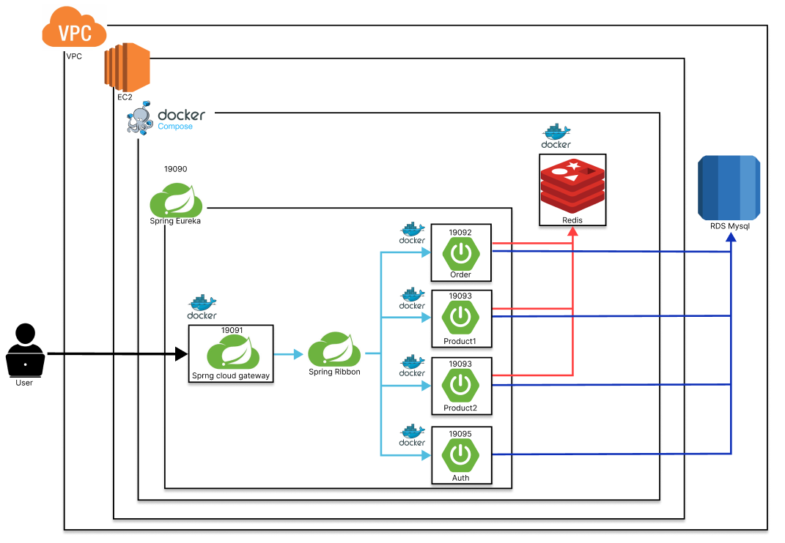

# MSA-Order-Service
 
기간 - 2024-11-27 ~ 2024-12-04
 

## Service Architecture

 

 

## 구현 목록

 

- 가중치 라운드 로빈 형식 로드밸런싱
- AOP를 이용한 Order, Product 권한 검증
- Oauth2, JWT를 통한 인증/인가 필터
- 주문 추가 시 FeignClient 요청을 통한 상품 서버 상품 목록 요청 및 검증 및 Fallback 기능 구현
- Redis를 이용한 상품 목록 및 주문 목록 캐싱
- 로컬 및 서버 환경 분리
- docker, docker compose를 사용한 서비스 EC2 배포
- 각 도메인별 값객체와 루트 애그리거트 적용
