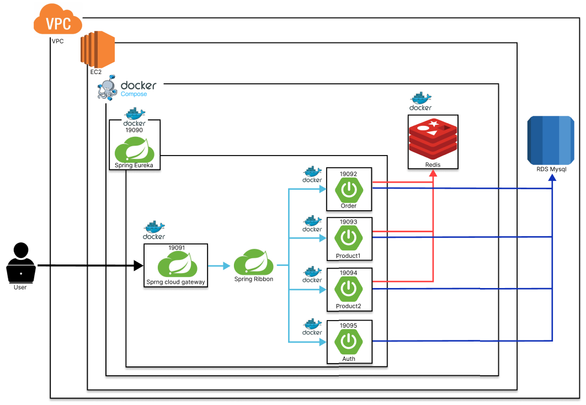

<!DOCTYPE html>
<html lang="en">
<head>
    <meta charset="UTF-8">
    <meta name="viewport" content="width=device-width, initial-scale=1.0">
    <title>MSA-Order-Service</title>
    
</head>
<body>
    <h1>MSA-Order-Service</h1>
    

    <h3>기간 - 2024-11-27 ~ 2024-12-04</h3>
    

    <h2>Service Architecture</h2>
    

    
    

    <h2>구현 목록</h2>
    

    <ul>
        <li>가중치 라운드 로빈 형식 로드밸런싱</li>
        <li>AOP를 이용한 Order, Product 권한 검증</li>
        <li>Oauth2, JWT를 통한 인증/인가 필터</li>
        <li>주문 추가 시 FeignClient 요청을 통한 상품 서버 상품 목록 요청 및 검증 및 Fallback 기능 구현</li>
        <li>Redis를 이용한 상품 목록 및 주문 목록 캐싱</li>
        <li>로컬 및 서버 환경 분리</li>
        <li>docker, docker compose를 사용한 서비스 EC2 배포</li>
        <li>각 도메인별 값객체와 루트 애그리거트 적용</li>
    </ul>
</body>
</html>
